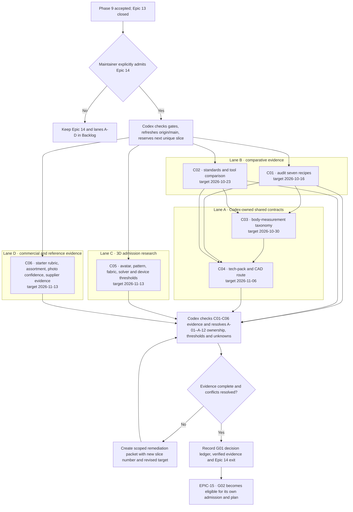

# InfiniDrip end-to-end capability roadmap

_Planning baseline: 2026-09-23. Maintainer direction recorded in the conversation of this date. This is the durable proposed work sequence and acceptance contract, not evidence that the capabilities exist. Current status and gates remain controlled by `PROJECT-STATE.md`, `docs/PROJECT-DECISIONS.md`, the pre-garment execution packet, and the actual code/Git state._

## Authority, scheduling, and completion rules

| ID | Decision / rule | Operational consequence |
| --- | --- | --- |
| R-01 | Phase 8 and Phase 9 are complete; the maintainer accepted bounded local reference V1 on 2026-09-24. Epic 14 evidence-only admission was separately granted on 2026-09-24 for C01/C02/C05/C06. A garment-direction approval is still required for garment implementation. | Phase 9 closure alone does not authorize roadmap work. The four admitted packets may produce reviewed evidence only; retain all other gates, including the separate garment-direction gate. |
| R-02 | The product is a user-led design and learning tool. No user-facing AI agent, prompt-to-garment shortcut, or silent auto-edit belongs in these goals. | Deterministic drafting, explicit choices, measurement coaching, visible invalid states, and user-approved suggestions are the product path. Development agents remain subject to `docs/OPENCODE-WORKFLOW.md`. |
| R-03 | Physical sampling stays on hold until the maintainer reopens it after the agreed digital capability work. | A complete digital feature can be marked digitally verified; physical fit, drape, factory acceptance, and production readiness stay unverified. Digital work cannot logically guarantee these real-world outcomes before physical evidence exists. Do not schedule physical sampling. |
| R-04 | Each garment starter is an independently vetted design, not a cosmetic blank. | Count a starter only after the complete pattern/view/spec/grade/export/construction pressure matrix and a qualified technical review; disclose any untested physical claim. No target of 500 arbitrary variants. |
| R-05 | All stages of the 3D program are part of the intended scope. A mannequin demo or one draped tee is not epic completion. | Research gate, avatar, every supported recipe and variant, pattern-to-mesh fidelity, calibrated material categories, edit propagation, performance, and end-to-end visual QA each have separate work packets. A failed solver proof creates a remediation packet, not a silent scope cut. |
| R-06 | This packet uses stable planning IDs (`C01` etc.), never landed slice numbers. | At execution, inspect `origin/main` and active history; reserve the next unique number; one landed `Slice N:` commit per slice. Splits and follow-ups get new numbers. |
| R-07 | Preserve current 100% application coverage, protected export byte identity, visible-invalid guidance, and actual rendered/drafted review. | An additive v2 output or version migration must prove unchanged legacy behavior; no baseline move without the existing explicit documented approval. |
| R-08 | Only local/no-cost capability may proceed under the launch-cost hold. | Live supplier identities, accounts, messaging, payments, cloud state, provider-backed features, paid tools/standards, hosted operations, and personal-data collection need the existing explicit launch gate. Local simulated end-to-end workflows can be developed first. |
| R-09 | Dates are planning targets, not time-based permission to cross a gate. Phase 9 closed with V1 acceptance on 2026-09-24; garment direction remains unapproved. | The 2026-10-05 first-start date is not authorization. Reforecast at every epic boundary only after the maintainer explicitly opens the relevant work; keep original target and reason for variance. |
| R-10 | The Control Center board remains the operational state source; this packet is the detailed future-scope source. | The 17 goals and immediate lanes A–E have Backlog records, without starting execution. Instantiate later packets only when their dependencies are ready. Review selects the earliest eligible packet after the maintainer admits roadmap work; do not bypass decisions reserved to the maintainer. |
| R-11 | The digital exit must precede the first real garment sample; the live order/quality/shipping pilot follows accepted physical evidence and commercial authorization. | G12 may develop supplier infrastructure conditionally but cannot close the physical sample/fulfilment promise. G15 and G16 remain gated future goals; their dates are forecasts for review, never instructions to buy, sew, contact or ship. |

## Evidence basis and professional comparison

| Evidence ID | Verified reference and what it establishes | InfiniDrip consequence / limitation |
| --- | --- | --- |
| E-01 | [ISO 8559-1:2017](https://www.iso.org/standard/61686.html), confirmed current in 2026, describes clothing body-measurement landmarks. | Use it as a measurement vocabulary and research input; exact paid text and any license must be obtained before claiming conformance. Body measures, finished garment POMs, and style/ease values require different fields. |
| E-02 | [ASTM D6193-16(2025)](https://store.astm.org/d6193-16r25.html) identifies stitch and seam types and stresses material-dependent seam engineering. | Build structured seam/operation references and show unknown machine settings; do not invent universal SPI, needle, thread or seam methods. Buying/reusing full standard material remains launch-cost gated. |
| E-03 | [Techpacker measurement cards](https://helpcenter.techpacker.com/hc/en-us/articles/360035467954-How-to-create-measurements-table), [versions](https://helpcenter.techpacker.com/hc/en-us/articles/360033521034-How-to-create-a-techpack-version), [approvals](https://helpcenter.techpacker.com/hc/en-us/articles/360059356933-How-to-assign-approval-status-and-due-dates-to-cards), and [QA size sets](https://helpcenter.techpacker.com/hc/en-us/articles/360034898133-How-to-use-QA-size-set-template) document richer industry workflows. | Minimum professional comparison: POM definition/tolerance, version diff and freeze, field approval, sample/QA entry, editable source, and clear supplier export. These are vendor-documented capabilities, not independently verified performance claims. |
| E-04 | [Browzwear's tech-pack workflow](https://browzwear.com/blog/vstitcher-and-lotta-update-techack-now-available-in-excel-format?hs_amp=true) exposes customizable BOM/colorway/artwork, schematic or 3D views, and Excel export. | Our pack needs user-selected sections and editable structured output; a pattern-piece sketch alone is not front/back garment technical flats. |
| E-05 | [CLO DXF import/export](https://support.clo3d.com/hc/en-us/articles/115000493067-2D-Pattern-DXF-Import-Export) distinguishes standard DXF, DXF-AAMA and DXF-ASTM and covers grading/notches. [ASTM D6673](https://store.astm.org/d6673-04.html) describes historic exchange semantics; ASTM's catalogue lists a later revision as withdrawn. | Treat industry CAD interchange as a compatibility target validated by round trips, not a claim that the present R12 DXF is AAMA/ASTM. Verify current format requirements and rights before implementation. |
| E-06 | [CLO schematic render documentation](https://support.clo3d.com/hc/en-us/article_attachments/48293801440281) and [Browzwear schematic rendering](https://browzwear.com/products/v-stitcher/) show how finished views can be used in packs. | Build 2D front/back technical flats from live construction metadata first; final side/oblique view must be 3D pattern-linked and labeled by confidence. A 2D flat is not a drape proof. |
| E-07 | [Tailornova's listed features](https://tailornova.com/explore) include editable measurements, vector flats, PDF patterns, DXF-AAMA, ease control and instructions; several 3D features on the same page are marked “coming soon.” | Benchmark actual accessible features in a live trial when possible, separating shipped behavior from marketing and future labels. Parity matrix applies to supported garment families, not every category a competitor markets. |
| E-08 | [GarmentCode](https://arxiv.org/abs/2306.03642) models component-based sewing patterns; [GarmentCodeData](https://arxiv.org/abs/2405.17609) describes pattern-linked XPBD draping. | Study algorithms and evidence, then implement within existing typed grammar; the repository audit forbids automatic runtime adoption or dataset reuse without exact license and dependency checks. |
| E-09 | [Fabric simulation systematic review](https://www.sciencedirect.com/science/article/pii/S0010448523001707) and [objective measurement study](https://salford-repository.worktribe.com/output/1330788/fabric-objective-measurements-for-commercial-3d-virtual-garment-simulation) document parameter and cross-system accuracy problems. | Drape realism is an empirical validation question. No physical-fit claim from shape keys, pleasing imagery, or a stable numerical solver. |
| E-10 | [Rags2Riches](https://anranqi.github.io/Rags2riches.github.io/) uses source and target sewing patterns and optimizes reuse of seams/hems. | Existing bolt nesting does not certify irregular source-garment panel feasibility. Photos alone support exploration; panel geometry and material facts are needed for cutting feasibility. |
| E-11 | [Fashion assortment research](https://www.sciencedirect.com/science/article/abs/pii/S0377221799004063) and [quick-response assortment planning](https://papers.ssrn.com/sol3/papers.cfm?abstract_id=4772862) couple breadth, size/color depth, demand uncertainty and delayed commitment. | Build explicit scenario/constraint planning rather than an opaque “collection generator.” Unknown demand is never converted into a forecast claim. |
| E-12 | `docs/research/MARKETPLACE-GOALS.md` shows India 100–300-piece supplier data and verification gaps; [GOTS](https://global-standard.org/find-suppliers-shops-and-inputs/certifiedsuppliers?product_category=PC0026) cautions that registry entries alone are not definitive certificate proof. | Marketplace supplier claims need current documents and outreach; public scraping alone cannot supply MOQ, lead time, capacity or reliability. |

## Known facts, ambiguity, and resolution before feature code

| ID | Fully known today | Unresolved or unknowable from current evidence | Required research/admission output | Default until resolved |
| --- | --- | --- | --- | --- |
| A-01 | Seven deterministic recipe families; named edges/components; graded redrafts; current POM and export functions. | Whether each recipe and option is sufficiently complete against a professional technician's per-garment expectation. | Per-recipe construction and parity matrix with source, edge/POM/BOM, render, grade, exported-file inspection and qualified review. | Label existing outputs as digital drafts; no “vetted factory-ready” badge. |
| A-02 | One local saved workspace and separate local artwork asset bytes. | Multi-style project schema, stable IDs, cross-style assets, local quota/backup behavior and migration handling. | Versioned style/project schema, migration matrix, recovery/export/import tests and storage-capacity pressure test. | Keep current single-style path available. |
| A-03 | Body and style values currently share one `Measurements` object; grade rules are recipe-fixed. | Which dimensions are body landmarks versus finished POMs or style controls for every recipe; whether some required dimensions need new fields. | ISO-informed, recipe-specific measurement dictionary with method diagrams and source/decision status; single-person grading policy. | No inferred fit or automatic graded run from a person's measurements. |
| A-04 | Current tech pack uses geometry-derived POMs and recipe BOM/construction defaults. | Missing POM anchors/tolerances, exact component/material specifications, supplier-owned unknowns, cost, approvals and all fields needed for a chosen production route. | Garment-by-garment tech-pack completeness inventory; two independent technical-design reviews of one simple and one difficult style; configurable “unresolved” schema. | Do not call a formatted pack production-approved. |
| A-05 | Current R12 DXF carries cut/sew polylines. | AAMA/ASTM layer/grade/notch/allowance/metadata expectations across real CAD importers. | Pinned format contract, fixture set and round-trip matrix in at least two independent compatible applications or independently parsed fixtures; exact paid-standard/format rights. | Retain “standard DXF” label only. |
| A-06 | Finished front/back technical views can derive outlines and construction marks from existing grammar with new rendering contracts. | Which seams/topstitches/hidden edges overlap in each view, and how side projection should handle depth. | View-spec matrix for every recipe and variant, pattern-to-view semantic mapping, legibility rules, technician review. | Side remains schematic until pattern-linked 3D is ready. |
| A-07 | Shape keys/GLB can represent and render editable body meshes. | Sparse measures do not uniquely determine body cross-section, posture or soft tissue; asset rights and landmark accuracy vary. | License/asset packet, parameter fitting method, landmark protocol, residual/error thresholds and uncertainty UI; adversarial body-shape fixtures. | Avatar is a measurement-constrained visualization, not a personal scan. |
| A-08 | Pattern meshes can be generated from 2D outlines and sewn by named interfaces in principle. | Cloth solver validity, fabric property calibration, collision robustness, visual fidelity, device performance and all-recipe coverage. | Literature review, material test protocol, isolated proof, numeric and visual benchmarks, per-recipe pressure matrix. | No fit/drape claim; solver failures remain visible and fallback to 2D. |
| A-09 | Artwork catalog has provenance and search/suitability logic; existing recipes have styles/options. | Number and diversity of *meaningful* validated starting designs and expert parity by category. | Starter taxonomy, duplicate/novelty criteria, licensing record and technical reviewer rubric. | No count target and no unsupported category expansion. |
| A-10 | SKU identity can be style × colorway × approved size; known quantities/prices can be summed exactly. | Actual size/color demand, fabric/trim availability and price, negotiated MOQ, production capacity, lead time, yield/shrinkage, freight/tax and return rate. | Explicit data dictionary with source/expiry/confidence and scenario formulas; supplier quotation fields; no hidden market forecast. | Show unknown; calculate conditional ranges only from user/supplier inputs. |
| A-11 | Source photos can show visible features and support user annotation. | Hidden construction, exact panel size, grain, stretch, damage and usable fabric cannot be established from an uncalibrated single view. | Evidence-level ladder and recipe-specific source-measurement guide; irregular-panel feasibility algorithm/independent validator research. | Photo-only route is exploratory. |
| A-12 | Local RFQ packets and synthetic workflow are feasible without network services. | Real supplier suitability, current MOQ/terms, contract role, support obligations, identity/privacy/hosting costs and response performance. | One-country evidence pilot, commercial-role decision, threat/privacy/cost packet and launch re-entry approvals. | No live match, payment, communication or “trusted supplier” claim. |

## Benchmark and release labels

| Level | Meaning | Minimum evidence | Disallowed claim |
| --- | --- | --- | --- |
| B0 draft | Current digital pattern/pack, or a new design with unresolved fields. | Deterministic checks, source-linked inputs and legacy export validation. | Factory-ready, accurate physical fit. |
| B1 digitally vetted starter | One specific recipe/preset/size-mode works through UI, pattern, front/back flat, component inventory, POMs, grading if applicable, construction and all exports; expert review issues closed or recorded. | Full automated gates, rendered/parsed/round-trip outputs, independent technical review record. | Physically validated, universal supplier approval. |
| B2 supplier-ready revision | Frozen B1 design with complete route-specific pack and acknowledged unknowns resolved by user/supplier evidence. | BOM/material, construction, size/color/packaging, version hash, approval and RFQ completeness. | Sample-approved or guaranteed manufacturability. |
| B3 digitally simulated | B1/B2 design with measured avatar residuals, linked 3D mesh, calibrated material class and passing numeric/visual/device matrix. | 2D↔3D invariants and stated model/material limits. | Actual fit or drape equivalence without physical validation. |
| B4 physical validation | Reserved for later maintainer reopening. | Sewn/sampled/inspected evidence from the actual garment/material/body and accepted corrections. | May not be assigned under the current hold. |

## Baseline schedule and parallel lanes

_Targets were reforecast at Epic 14's limited evidence admission on 2026-09-24. They assume one Codex-owned integration lane, bounded research kept in separate artifacts, roughly 2–4 focused engineering days per landed slice, and no new paid service. Dates shift with evidence and review gates. These are target review dates, not permission to spend, contact suppliers, or start physical work._

| Goal | Priority / target | Start if gates pass | Target exit | Dependencies / parallel lane | Estimated landed slices | Whole-goal completion condition |
| --- | --- | --- | --- | --- | ---: | --- |
| G00 Phase 8/9 closure | P0 | Complete 2026-09-24 | Closed 2026-09-24 | Existing binding sequence | Slice 203 plus S207–S210 evidence | Phase 9 evidence and bounded V1 acceptance recorded. This does not include or imply explicit garment-direction approval. |
| G01 Admission and professional baseline | P0 | 2026-09-24 | 2026-11-13 | Admitted C01/C02/C05/C06 evidence wave; C03/C04 and G01 integration remain downstream | 8 base slices plus separately numbered remediation if needed | A-01–A-12 ownership, acceptance thresholds and unresolved facts recorded; professional parity matrix and scope decisions accepted. |
| G02 Versioned style foundation | P0 | 2026-11-16 | 2027-02-12 | G01; integration lane | 7–10 | Multi-style local record, final edits, revisions and dependency invalidation proven without breaking legacy saves/exports. |
| G03 Measurement-first creation | P0 | 2027-02-15 | 2027-05-14 | G02; can parallel with technical-flat specialist research | 6–9 | One measured size, coach, editable continuation and separately approved grading work for all supported recipes. |
| G04 Professional flats and CAD interchange | P0 | Research 2026-10-05; code 2027-02-15 | 2027-07-16 | G01/G02; integration serialized with G03 | 9–14 | Front/back technical flats for every supported recipe/variant and proven CAD interchange. Pattern-linked side/oblique views are explicitly owned by G09/D04, so the complete view set is accepted only there. |
| G05 Living production tech pack | P0 | Research 2026-10-05; code 2027-04-05 | 2027-10-15 | G02 opens T01; G04 and G03 feed later export/POM packets | 12–18 | Editable source, full configurable sections, provenance, approvals, QA fields and frozen exports across all supported recipes. |
| G06 Professionally vetted starting designs | P1 | Research 2026-10-05; implementation 2027-05-17 | 2027-12-17 | G02 opens registry work; G04/G05 required for final B1 review; garment-family work can run in disjoint geometry lane | 10–16 plus recipe expansion below | Curated, independently reviewed starter register; no counted item lacks B1 evidence. |
| G07 Researched garment expansion | P1, conditional on Phase 9 garment approval | 2026-10-05 earliest | 2027-12-17 target for researched set | Existing garment synthesis; shorts and upper-body foundation may run concurrently only in disjoint worktrees | 34–47, plus jogger cuff 2–3 if included | Each new recipe passes its own researched geometry/grade/POM/BOM/output matrix and B1 digital review; no physical-fit claim. |
| G08 Brand and collection planning | P1 | Research 2026-10-05; code 2027-07-19 | 2028-02-18 | G02 opens brand profile; G05/G06 feed SKU and assortment packets; research parallel with G01 | 11–16 | Brand rules and user-approved defaults; linked assortment/SKU/quantity/cost/MOQ scenarios without invented data. |
| G09 Measurement-driven mannequin and 3D | P1 research, P2 implementation | Research 2026-10-05; code 2027-05-17 | 2029-03-16 digital exit target | G02 opens D01; G03/G04 required for fitting and pattern-linked garment; asset/research work parallel, shared UI/export integration serial | 35–55, re-estimate after proof | Avatar, all supported pattern-linked garments/variants, material-aware solver, editing, visualizations and performance pass B3 matrix; no stopping at mannequin/basic preview. |
| G10 Reference and upcycling | P2 | Research 2026-10-05; code 2027-08-23 | 2028-08-18 | G02/G03 open photo/measurement route; G06 improves target library; irregular-panel proof after source-measure contract | 10–16 | Photo-first exploratory design, measurement coach, source inventory, conservative feasibility and end-to-end transformation guide. |
| G11 Local supplier-ready workflow | P1 | Research 2026-10-05; code 2027-10-18 | 2028-01-19 | G05 B2; supplier research parallel, no external contact without authorization | 5–8 | Frozen packet, RFQ/quote/sample/revision workflow simulated locally; no live transaction claim. |
| G12 Live marketplace infrastructure | P2, launch gated | Research 2026-10-05; code no earlier than launch re-entry | 2029-06-15 *conditional planning target* | G11 plus approved identity, privacy, legal/commercial role, operating costs and actual supply | 9–15 software, separate unknown operations | Validated supplier directory, revision-bound messaging/quotes, audit and support foundation; no real sample, production, payment or shipping acceptance before G15/G16. Cost/approval hold may shift date indefinitely. |
| G13 Launch and line-sheet outputs | P2 | 2028-02-21 | 2029-05-18 | G05/G08 open X01; G09 required for X02 imagery; live inventory/terms only with G12 | 5–8 | Version-bound listings, size guide, line sheets and truthful renders; price/material/delivery claims verified. |
| G14 Cross-system digital exit | P0 at digital boundary | 2029-03-19 earliest | 2029-07-27 *conditional target* | G02–G13; live G12 separately gate-controlled | 6–10 | Two-style adversarial change trace through every digital output, independent designer/factory document review, digital limitations published; B4 remains on hold. |
| G15 Physical validation | P0 when explicitly reopened; currently held | Only after G14 exit and a separate maintainer decision | 2029-11-16 *conditional forecast, not authorized schedule* | G14 plus actual patterns, material, wearer/body, qualified maker and test protocol | 4–8 coordination/revision slices, fabrication time unknown | Actual cut/sew/sample measurements and fit/drape findings entered into the revision graph; changes retested and approved. Only then may B4 be assigned to proven cases. |
| G16 Operational manufacturing and fulfilment | P2, launch and physical gates | Only after G15 acceptance and commercial approval | 2030-06-28 *conditional forecast, not authorized schedule* | G12/G15 plus contracts, payment role, quality/shipping partners and support capacity | 8–14 software/operations slices, external lead times unknown | Real order, production, QC, payment, shipment and dispute/return paths piloted against the accepted revision, with evidence and rollback. |
| G17 Dense production-art library | P2, sequenced last | Only after completion and review of G01–G16 and a future scope checkpoint | Unscheduled | G16 plus a refined rights, relevance, format, density and bundle budget; no garment gate is bypassed | Unestimated until the future scope checkpoint | Build a dense, categorized, searchable fashion-design artwork library from individually rights-verified, use-case-relevant assets. Separate reference photos/studies from clean production artwork and repeat-verified tiles; remain local/no-cost with no runtime fetch. Any paid license or service requires the maintainer to reopen the launch-cost hold before commitment. |

_The G01–G16 ranges sum to approximately 176–272 landed slices, including the researched garment set, digital exit, and gated physical/operational follow-through. G17 is additional and deliberately unestimated until its scope checkpoint after G16. These are order-of-magnitude planning bounds, not preassigned slice numbers. The total excludes revisiting failed proofs, supplier acquisition, paid standard/tool access, actual fabrication lead time and unbounded launch operations. Calendar overlap is limited to disjoint work; one integrated product release path remains serialized._

## Immediate parallel work and resource routing

### Canonical Epic numbering and board ownership

Epic 13 is the last completed numbered Epic and groups the nine accepted pre-garment phases. Epic 12 remains open for deferred launch-backed work. The future capability goals were initially tracked as `CAPABILITY-G01` through `CAPABILITY-G17`; the canonical Control Center now gives them numbered Epic records and goal cards. Existing dependency references were migrated through the validated command layer; old IDs in historical decisions, evidence and notes remain historical aliases. On 2026-09-24 the maintainer admitted Epic 14 for the four immediate evidence packets below; the other numbered Epics remain **Backlog**. Lane A remains queued, lanes B–D are active, and lane E stays held under Epic 20. Admission authorizes only the recorded evidence wave; it does not authorize garment code, spending, supplier contact or physical sampling.

| Goal | Numbered Epic | Goal | Numbered Epic | Goal | Numbered Epic |
| --- | --- | --- | --- | --- | --- |
| G01 | EPIC-14 | G07 | EPIC-20 | G13 | EPIC-26 |
| G02 | EPIC-15 | G08 | EPIC-21 | G14 | EPIC-27 |
| G03 | EPIC-16 | G09 | EPIC-22 | G15 | EPIC-28 |
| G04 | EPIC-17 | G10 | EPIC-23 | G16 | EPIC-29 |
| G05 | EPIC-18 | G11 | EPIC-24 | G17 | EPIC-30 |
| G06 | EPIC-19 | G12 | EPIC-25 | — | — |

| Lane | Control Center item | Type / status | Owning Epic | Packet scope and later destination |
| --- | --- | --- | --- | --- |
| A | `EPIC-14-LANE-A` | task / Backlog | EPIC-14 · G01 | C03–C04 shared measurement, pack and CAD contracts; waits on C01/C02; feeds G02 and later outputs. |
| B | `EPIC-14-LANE-B` | research / In Progress | EPIC-14 · G01 | C01–C02 seven-recipe and professional parity evidence; informs A and the garment lane. |
| C | `EPIC-14-LANE-C` | research / In Progress | EPIC-14 · G01 | C05 3D feasibility and proof thresholds; later implementation belongs to EPIC-22 · G09. |
| D | `EPIC-14-LANE-D` | research / In Progress | EPIC-14 · G01 | C06 starter, assortment, upcycling and supplier evidence; later work belongs to G06/G08/G10/G11. |
| E | `EPIC-20-LANE-E` | task / Backlog | EPIC-20 · G07 | G01S casual shorts; executable only after explicit garment-direction approval and relevant C01/C03 findings. |

The lanes are child work packets, not five additional Epics. The maintainer admitted C01/C02/C05/C06 on 2026-09-24; they are active in disjoint work. Lane A remains Backlog until C01/C02 are accepted. E has the stronger garment-direction gate. Board dependencies point to completed Phase 9 as the earliest entry point, while each lane retains its stronger decision and integration gates.

_A work lane may research ahead of its code dependency; its output cannot change the live product until the dependency and maintainer gates pass. This is the admitted first post-Phase-9 evidence allocation. These are parallel work packets, not concurrent writes to shared contracts._

_A Control Center goal dependency marks the earliest engineering entry gate. Later packets within that goal retain their stronger dependencies in this document, so early research or a local module can proceed without falsely declaring the whole goal complete._

| Lane | Starts after Phase 9 | Output by 2026-11-13 | Independence / handoff | Gate before integration |
| --- | --- | --- | --- | --- |
| A · Codex control | C03–C04 measurement, pack and CAD contracts, with C01 findings incorporated | Accepted body/garment/control dictionary and cross-output schema | Sole owner of shared contracts, board states, review and integration | Phase 9 outcome; choose and record decisions, then G02 |
| B · comparative evidence | C01–C02 recipe audit and professional tool/standard comparison | Source-dated parity and discrepancy matrix; live-trial status separated from vendor claims | Entirely delegable as read-only research in a separate worktree; no common code files | Codex verifies primary references and observes selected outputs |
| C · 3D research | C05 anthropometry, Blender/GLB rights, pattern/solver/fabric protocol | Falsifiable proof specification and numeric/visual/device thresholds to be approved | Literature, test fixture and asset audit can be delegated; solver and acceptance remain Codex-owned | No app-level 3D implementation before C05 acceptance |
| D · commercial/reference research | C06 starter rubric, assortment uncertainties, upcycling evidence levels and supplier facts | Uncertainty ledger and measurement/verification checklists | Research packets can be independently owned by separate contributors; no supplier outreach | Only confirmed fields enter F02; paid/live work remains held |
| E · garment lane | G01S shorts execution packet after research and explicit garment approval | Garment-specific numbered slices, not an unreviewed recipe merge | Can run parallel to B/C/D only with disjoint worktree and Codex review; lower-body shared geometry stays serialized | Phase 9 garment authorization plus the relevant C01/C03 findings |

| Work class | Default model/reasoning | Delegation and parallel scope | Must remain with Codex / external expertise | Cost and capacity assumption |
| --- | --- | --- | --- | --- |
| Routine bounded code, docs, tests, local UI | Codex Luna at max reasoning under `AGENTS.md`; exact model selected per available host | Claude Code CLI or OpenCode CLI can own disjoint lower-intensity packets; OpenCode only Muse Spark 1.3 xhigh in normal mode | Codex reviews diff, tests, rendered/drafted output and lands slice | One integration lane; 2–4 focused days per slice, not elapsed calendar days |
| Measurement/grammar, persistence, grading, CAD, versioning, change graph | Codex Luna max implementation; short Sol or Terra high/xhigh review at decision points | Independent measurement illustrations, fixtures, standards research and usability checks | Shared interfaces, geometry and protected exports remain Codex-owned | Included in 167–255 slices; paid standard text/tool licenses are not assumed available |
| 3D avatar assets, rig/morph authoring, neutral visual examples | Codex Luna max integration; specialist 3D review when tests expose a hard issue | A licensed Blender/GLB asset and asset documentation can be fully outsourced as a bounded deliverable; no concurrent shared renderer edits | Parameter fitting, 2D↔3D invariants, solver admission and product claims | Blender/local open tools first; asset contractor or fabric measurements require a separately approved quote if not free |
| Cloth numerics, fabric calibration, CAD interchange proof | Codex Luna max implementation; Sol/Terra high/xhigh for short adversarial design reviews | Independent benchmark fixtures and external importer inspection can run parallel | Solver architecture, failure handling, calibration acceptance and exporter remain Codex-owned | Material specimens, professional CAD seats and calibrated tests may add unknown cost; gate those before purchase |
| Tech-pack content, starter professional review, human factors | Codex Luna max data/output integration | Qualified technical designer can fully own a specified review or illustration packet; reviewers do not change app architecture | Codex reconciles all findings and chooses new slices; maintainer retains product decisions | Expert review time is an unpriced dependency until a quote and scope exist |
| Supplier operations, launch/legal/privacy, marketplace | Codex Luna max local workflow; short Sol/Terra high review for architecture or contract-risk analysis | Supplier research and operating procedures can be separate human work packages after authorization | Codex owns revision truth and technical integration; maintainer approves contacts, role and spend | Live cost is unknown and not in the no-cost baseline; G12 dates remain conditional |
| Cross-system and physical claims | Codex Luna max test orchestration; independent technical designer/factory document review where obtainable | Third parties can review fixed evidence packets, not declare code complete | Codex owns final digital gate; maintainer alone reopens physical sampling | 352–1,088 focused engineering days from the stated range; monetary labor cost = days × agreed blended day rate, currently unknown |

_No entire G01–G16 epic is fully outsourced: each crosses the common design record and final review. Bounded research, licensed 3D assets, illustrations, importer trials and expert reviews can be complete external deliverables. Safe CLI contributions require the separate worktree, disjoint ownership, exact `WORK FINISHED` signal and Codex-controlled review in `docs/OPENCODE-WORKFLOW.md`._

## Planned work packets (stable IDs, not landed slice numbers)

| ID | Goal / target date | Scope and dependencies | Exit evidence; next gate | Ownership / parallel safety |
| --- | --- | --- | --- | --- |
| C01 | G01 · 2026-10-16 | Audit all seven recipes against professional baseline: measurement method, editable controls, pattern topology, seam/mark and construction map, POM, grade, flat, BOM, file formats. | Per-recipe gap matrix, sources and risk rank; no unsupported “industry compliant” claim. | Independent research packet; Codex decides. |
| C02 | G01 · 2026-10-23 | Obtain primary standard/industry vocabulary and compare Tailornova, CLO, Browzwear, Techpacker, Genpire using live trial where possible; separate marketing from observed behavior. | Feature/format parity matrix with evidence URL, date, trial status and category applicability. | Delegable read-only research; no dependency purchases. |
| C03 | G01 · 2026-10-30 | Resolve A-03 measurement taxonomy using ISO-informed landmark definitions; specify body vs desired finished vs garment options vs derived values. | Seven recipe input dictionaries, instructions, missing measurement policy and no silent estimates. | Codex domain decision; independent draft research allowed. |
| C04 | G01 · 2026-11-06 | Resolve A-04/A-05 technical-pack and CAD route, section schema, optional vs required fields, DXF compatibility targets and tests. | Accepted technical design and CAD import/export test fixtures; old R12 path retained. | Codex owns interfaces; expert/research review disjoint. |
| C05 | G01 · 2026-11-13 | Resolve A-07/A-08 3D admission: mesh rights, anthropometric fitting, pattern rest mesh, seam map, material test protocol, objective numeric and visual metrics, performance devices. | Evidence dossier and go/no-go test thresholds before app code. A no-go creates remediation scope, not feature closure. | Research can run alongside C01–C04; Codex acceptance. |
| C06 | G01 · 2026-11-13 | Resolve A-09/A-10/A-11/A-12: starter rubric, assortment source/expiry fields, photo confidence levels, supplier evidence. | Decision ledger; unresolved external facts remain explicit user/supplier inputs. | Independent research lanes; shared schema decision serialized. |

### Epic 14 execution order and parallel boundaries

The sequence diagram was shown and its live dependencies were confirmed before the first Epic 14 slice on 2026-09-24. Epic 14 is admitted for C01, C02, C05, and C06; this wave must finish and pass review before stopping. The diagram remains the execution map for stable packet IDs and does not reserve landed slice numbers. G01's 5–8-slice estimate is a conditional forecast and will be re-estimated from actual work. Codex reserves each unique `Slice N` at execution, integrates one change at a time, and keeps shared contracts and the Epic exit in one review path. Read-only research and asset/proof evidence may proceed in parallel only with disjoint ownership.

| Order | Work packet | Dependency and overlap | Owner / integration rule |
| ---: | --- | --- | --- |
| 0 | Admission and slice reservation | Phase 9 is complete, but future roadmap work remains held until explicit instruction. | Codex confirms the gate, checks current history and assigns actual slice numbers only when work starts. |
| 1 | C01 + C02 (Lane B) | Independent evidence collection can overlap. Their accepted findings feed C03/C04; avoid duplicate recipe or vendor audits. | Bounded research may be delegated read-only; Codex verifies evidence and rendered examples. |
| 1 | C05 (Lane C) | Research can overlap C01–C04. Its feasibility thresholds must be accepted before any later G09/EPIC-22 3D implementation. | Research/assets can be disjoint deliverables; Codex owns go/no-go and product claims. |
| 1 | C06 (Lane D) | Research can overlap the other lanes. Shared schema decisions wait for Lane A; supplier outreach and paid sources remain held. | Independent evidence gathering; Codex reconciles decisions. |
| 2 | C03 (Lane A) | Starts from recipe needs in C01 and uses C02 vocabulary/standards evidence; defines body measures separately from finished POMs and style options. | Codex owns the accepted dictionary and missing-value policy. |
| 3 | C04 (Lane A) | Uses C01/C02 gaps and C03 taxonomy to set tech-pack sections and CAD compatibility tests. | Codex owns shared interfaces; expert review can run separately. |
| 4 | G01 integration and exit | Combine accepted C01–C06 evidence; resolve or assign each A-01–A-12 fact, run remediation if needed, and record the exit evidence. | One Codex integration/review lane; only then can G02 be considered. |

The visual's parallel branches represent separate packets, not multiple agents editing the same shared files. The maintainer admitted C01/C02/C05/C06 for evidence work on 2026-09-24; C03/C04, any garment implementation, and the G01 integration remain queued behind their stated gates. Lane A's shared-contract work is serialized. Every landed change still receives a unique slice number and a Codex-reviewed integration. Admission of these four evidence packets does not imply concurrent writes or authorize the other queued work.
| F01 | G02 · 2026-12-11 | Local project/style entities, stable IDs, export/import/backup and migration from `SaveFile`; preserve artwork IDs. | Multiple styles survive reload and recovery; malformed data rejects visibly; old files migrate. | Codex persistence owner; UI mockups parallel only. |
| F02 | G02 · 2027-01-15 | Source-aware field model and dependency graph: measured/chosen/calculated/inherited/supplier/unresolved; value history and affected-output invalidation. | A changed field marks exact dependent artifacts stale, not unrelated fields. | Codex shared-model owner. |
| F03 | G02 · 2027-02-12 | Promote Edit to durable final edits only through recipe-owned constraints, size semantics, conflict handling, undo and re-draft/export propagation; immutable revision snapshots and hashes. | Edit once and compare 2D pattern, POM, grade, nest, flat, pack, save/reload and frozen revision. | Codex core; high-review gate. |
| M01 | G03 · 2027-03-12 | Garment selection offers two routes; recipe-specific guided body landmarks and measurement help, units, provenance, missing/contradictory values. | Every supported garment shows only true required inputs, no silent clamping; accessible/narrow QA. | Narrow UI delegated if disjoint; Codex logic. |
| M02 | G03 · 2027-04-09 | Construct one size deterministically from selected measurements, explicit style/ease choices and declared defaults; transition into full existing editor. | Geometry/controls/export identical to full-flow design for same values; no forced step-by-step edits. | Codex drafting/integration. |
| M03 | G03 · 2027-05-14 | Separate grade plan: named population/size chart, chosen rules, base size, per-size override and approved run; single-size export remains first option. | Custom wearer cannot acquire a graded run merely from default recipe increments; size table reconciles with cutting files. | Codex grading/export owner. |
| V01 | G04 · 2027-04-02 | Define technical-flat primitives: sewn silhouette, visible/hidden seams, topstitch, closures, pockets, pleats/darts, artwork, callouts and layer order. | Source-to-view map for all seven recipes; technician rejects incoherent or missing features. | Codex render contract; visual asset polish can be delegated. |
| V02 | G04 · 2027-05-28 | Live front/back vector flats from same pattern/revision; proportional and construction annotations, variant/colorway overlays, POM callout anchoring. | All supported options have front/back snapshots and checks against pattern topology; no disconnected image redraw. | Codex render integration; disjoint visual QA. |
| V03 | G04 · 2027-07-16 | Industrial CAD exchange proof and optional new exporter; grade/notch/allowance/units/labels; round-trip import fixtures. | Label exact formats only after documented external import/round-trip; old DXF bytes unchanged. | Codex export owner; independent importer inspection delegated. |
| T01 | G05 · 2027-05-14 | Style cover, revision, base size, approval state, editable BOM, fabric/trim supplier/lot/spec, colorway, and source per field. | Changing fabric or trim updates pack, cost inputs, affected view and frozen-revision status; unknowns visible. | Codex data model; focused UI delegated. |
| T02 | G05 · 2027-06-25 | POM methodology, landmarks, asymmetric tolerance option, size-run and grade rule source, all-callout checks; editable sample/QA records remain separate from predictions. | No POM silently lacks a definition; missing tolerance blocks supplier-ready level if required by route. | Codex geometry/POM owner. |
| T03 | G05 · 2027-08-06 | Operation-by-operation construction: seam/stitch type, allowance, SPI/thread/needle when sourced, pressing/finish, special instructions, labels/packaging, tests and compliance fields. | Component inventory matches pattern and BOM; user/supplier decisions and unknowns clearly differentiated. | Expert content research delegated; Codex schema/validation. |
| T04 | G05 · 2027-09-17 | Route-specific costing and tech-pack templates; selected pages in PDF plus structured editable export, image/vector attachments, field-level diff and approval. | Two independent example styles pass human readability, numeric reconciliation and re-import/round-trip where supported. | Codex export owner; isolated document rendering QA delegated. |
| T05 | G05 · 2027-10-15 | Freeze supplier revision; manifest/hash, approvals, dependency invalidation and compatibility with legacy techpack. | RFQ can pin immutable revision; change creates new revision and explicit delta; legacy eight hashes unchanged. | Codex review and integration. |
| L01 | G06 · 2027-06-18 | Starter taxonomy: recipe/base block, pattern topology, adjustable axes, fabric domain, construction route, intended user, distinctness and license provenance. | No unlicensed/copied commercial patterns; planned starter count based on unique validated combinations, not marketing quantity. | Independent research; Codex admission. |
| L02 | G06 · 2027-09-17 | Build curated local starter registry for existing supported families, each with recipe-owned values, illustration, fit intent and known limits. | Starter loads, remains fully editable and preserves same outputs after save/reopen. | Data/visual entries delegable; Codex geometry and integration. |
| L03 | G06 · 2027-12-17 | Apply B1 matrix to each counted starter; technical-design review, difficult cases and export inspections; publish per-starter evidence/status. | Zero counted “vetted” starters lack matrix or carry unresolved digital failures; physical column remains pending. | Codex final review; independent technical designer review beneficial. |
| G01S | G07 · 2026-12-18 | Casual woven shorts after Phase 9 garment approval; upper trouser block/short continuation, fly/pocket/hem interactions. | 7–9 slices per existing garment synthesis, all current outputs and new matrix pass. | Codex lower-body; parallel only with disjoint upper-body work. |
| G02S | G07 · 2027-03-19 | Crewneck sweatshirt with true bands, stretch-to-fit seam and separate main/rib material plans. | 6–9 slices; no invented rib recovery, material consumption or physical fit. | Disjoint upper-body geometry; shared integration serialized. |
| G03S | G07 · 2027-05-28 | Jogger pull-on waist, user-fit elastic, pockets, taper; optional cuff only with accepted stretch join. | 5–7 + optional 2–3 slices; no overlap with shorts lower-body source edits. | Codex lower-body. |
| G04S | G07 · 2027-08-13 | Hoodie extension from accepted sweatshirt neckline/body; real lined hood and pocket. | 5–8 slices; adult scope and drawcord guidance enforced. | Upper-body after sweatshirt. |
| G05S | G07 · 2027-12-17 | Rigid jeans: yoke, pockets, asymmetric fly, waistband, loops, marks and grading. | 11–14 slices; no hidden stretch/shrinkage assumption; all B1 digital gates. | Codex lower-body after shorts/jogger source settles. |
| A01 | G08 · 2027-09-17 | Brand profile: optional colors/assets/rules/blocks/supplier constraints; editable manual apply and conflict explanations. | No agent or automatic designer takeover; no rule silently overrides user choice. | Local UI/content parallel; Codex validation. |
| A02 | G08 · 2027-11-19 | Collection hierarchy and SKU/variant graph with style revisions, shared materials, distinct size plans and colorways. | Changing one style propagates only relevant line-sheet/quantity/cost fields; stale dependencies shown. | Codex shared data owner. |
| A03 | G08 · 2028-02-18 | Scenario planner: user-entered demand/price/cost/MOQ/capacity/delivery intervals, integer quantities, margin and uncertainty; no claimed forecast. | Constraint violations and unknown sources are visible; two adverse scenarios pressure-tested. | Mathematical core Codex; research independent. |
| D01 | G09 · 2027-05-14 | Isolated GLB/mannequin asset proof: license/notice audit, units, landmarks, morph limits and local load. | Asset is reusable, offline and exportable; exact source and rights recorded. | 3D asset specialist can fully own artifact; Codex integration decision. |
| D02 | G09 · 2027-09-17 | Measurement-driven avatar fitting: shape parameters, residuals, alternate profiles/posture controls, male/female starting presets only. | Supplied measures reproduced within research-approved thresholds; unsupported inference is disclosed. | Codex fitting core; asset edits disjoint. |
| D03 | G09 · 2028-01-19 | Triangulate live piece shapes, attach semantic seam/mark/artwork metadata, stitch corresponding edges and place on avatar. | One-to-one 2D↔3D piece identity, seam lengths, winding, units, grade/edit propagation; collisions reported. | Codex geometry and renderer; no separate generated design. |
| D04 | G09 · 2028-05-19 | Expand assembled 3D garment to every supported recipe and approved starter/option/size mode; front/back/side/oblique and section/inside views. | Per-recipe visual matrix, occlusion/material/closure/topology checks; measured views remain traceable to 2D. | Codex integration; visual QA can be delegated. |
| D05 | G09 · 2028-09-15 | Material schema and isolated cloth solver: stretch/shear/bend/weight/friction/thickness/direction, seam constraints, collision and deterministic reset/fallback. | Known material categories calibrated to available evidence; unstable or unsupported cases fail visibly; no false fit map. | Specialist numeric review; Codex admission/integration. |
| D06 | G09 · 2028-12-15 | All-recipe cloth/material/render pressure matrix; performance across target devices, exportable stills and design-change re-simulation. | Solver, render, pattern, spec and flattened view stay revision-synchronized; regression and artifact bundle. | Codex final integration; independent review. |
| D07 | G09 · 2029-03-16 | Digital 3D exit and limitations: replay adversarial avatars/materials, compare controlled drape evidence where permitted, document remaining physical gap. | B3 earned only for passing cases; incomplete cases receive follow-up packet; B4 stays held. | Codex high-review decision. |
| U01 | G10 · 2027-10-15 | Photo/sketch reference intake with local-only assets, perspective/scale cues, user-marked visible construction and source rights. | Supports start-from-photo without claiming reconstructed hidden pattern. | Isolated UI/asset workflow delegable; Codex data contract. |
| U02 | G10 · 2028-01-19 | Source garment measurement coach: recipe-specific flat dimensions, panel outlines, grain/stretch, defects, reusable seams/hems/trims and measurement confidence. | Photo-only, scaled photo and measured states distinct; exact missing facts explained. | Domain research independent; Codex guidance. |
| U03 | G10 · 2028-04-21 | Target A to B mapping through supported recipe and editable geometry; compare source and target components, required supplements and transformation order. | No target topology invented from a photograph; unsupported transformations receive precise manual decision requests. | Codex pattern core. |
| U04 | G10 · 2028-08-18 | Conservative irregular-panel packing/reuse proof with grain, fold, pair, defect and retained seam constraints plus exact validator. | “Feasible to cut” only when actual source measurements and layout satisfy all constraints; otherwise exploratory. | Codex algorithm/validation; external solver only after separate audit. |
| S01 | G11 · 2027-11-19 | Local RFQ packet: revision, route, quantity/size/color, materials, responsibilities, incoterm/location, sample need, timing and open issues. | Reproduce same immutable packet for multiple recipients; missing quote-critical fields block B2 handoff. | Codex shared pack. |
| S02 | G11 · 2028-01-19 | Local quote comparison and synthetic sample/production communication log with version-bound attachments and change requests. | A post-RFQ revision forces explicit addendum/requote; no user or supplier account needed. | Local UI may be delegated; Codex version logic. |
| S03 | G12 · 2028-04-21 conditional | India supplier/intermediary research and operating-model admission, without unsolicited contact: capability, 100–300 MOQ, current lead times, verification, revenue and contract role. | Partner/outreach proposal and evidence plan; no public-directory “trusted” label. | Business specialist research; contact needs separate authorization. |
| S04 | G12 · 2028-08-18 conditional | Reopen launch identity/consent/backend/legal/cost decisions before any live code or payments. | Signed-off spend and responsibility envelope, security/privacy model and rollback plan. | Maintainer decision; no calendar auto-approval. |
| S05 | G12 · 2029-02-16 conditional | Supplier accounts/capabilities/verification, revision-bound RFQ/messages/quotes, sample approvals and audit log. | Real partner pilot proves same-version quotes and traceable changes; platform makes no unsupported factory claims. | Codex architecture; independent UI modules only with disjoint ownership. |
| H01 | G15 · conditional after G14 | Maintainer reopens physical sampling with bounded style, size, wearer, material, maker, cost and observation protocol; preserve baseline pattern/revision. | Authorized sample packet, objective POM/fit/drape checkpoints and exact comparison method. | Maintainer decision and qualified technical designer; Codex records version. |
| H02 | G15 · conditional | Cut and sew the frozen chosen garment, log actual fabric/trim properties, construction deviations, actual measurements and fit observations. | Source documents/photos and structured QA entered into the product record; no predicted value masquerades as measurement. | Qualified maker/technical designer; Codex product integration. |
| H03 | G15 · conditional | Correct block, ease, construction, grade, fabric and pack as evidence requires; produce new frozen revision and sample again when changes affect physical outcomes. | Accepted sample/revision comparison, all downstream outputs and supplier packet reconciled. | Codex geometry/pack; maker repeats evidence as needed. |
| H04 | G15 · 2029-11-16 conditional review | Repeat H01–H03 across a representative simple/difficult style and relevant sizes/materials; record where model disagrees with reality. | B4 only for actually validated configurations; unresolved cases stay open with follow-up work. | Codex review plus independent technician; cost and lead time gated. |
| O01 | G16 · conditional after G15 | Finalize merchant/intermediary role, supplier contract, payment, dispute, returns, quality responsibility, privacy and support runbooks. | Explicit maintainer and specialist approval of legal/financial role, operating costs and incident owner. | Business/legal/ops expertise; Codex integration. |
| O02 | G16 · conditional | Implement version-bound PO, payment status, QC evidence, shipment milestones and exception handling on the accepted sample/production revision. | No UI status without a supplier/logistics/payment source; correction, cancellation, retry and rollback paths tested. | Codex technical core; bounded UI disjoint. |
| O03 | G16 · 2030-06-28 conditional review | Pilot one controlled live order through production, inspection, fulfilment, support and reconciliation; record times/costs/failures. | User receives the approved physical product; operational evidence closes the loop or new packets remain open. | Supplier and ops execution; Codex audit/technical review. |
| X01 | G13 · 2028-06-16 | Version-linked line sheets, size guide, listing descriptions, wholesale/retail fields and export formats from approved style/collection records. | SKU, composition, prices and sizes reconcile with pack; unknown delivery and legal claims stay blank. | UI/output module disjoint after record contract. |
| X02 | G13 · 2029-05-18 | Consistent 3D/editorial-style renders from pattern-linked material/lighting scene; labeling and claim review. | Images match the frozen revision and are identified as renders; actual product photography remains separate. | 3D render specialist assets; Codex revision truth. |
| Q01 | G14 · 2029-05-18 | Designer parity challenge: seven baseline recipes plus newly approved recipes, one ordinary and one difficult style, live edits to measure/seam/material/artwork/grade. | Every dependent output changes together or is invalidated; expert review flags resolved or tracked. | Codex control, independent technical review. |
| Q02 | G14 · 2029-07-27 | Entire digital chain replay: measurement or reference → editing → views/3D → tech pack → collection → local/live supplier route → listing, with failure/rollback drills. | B0–B3 statuses honest; release packet and long-term maintenance owner recorded; no physical-ready claim. | Codex final gate. |

## Automatic work-selection and delegation rule

| Trigger | Next action without another reminder | Stop/ask boundary |
| --- | --- | --- |
| Phase 9 is complete; garment direction is not approved | Stop at the maintainer discussion/decision. No future roadmap item starts automatically. | Do not start G01, G07, or any garment queue until explicitly instructed. |
| G01–G16 are all complete and reviewed | Revisit G17 scope, rights/cost constraints and acceptance details with the maintainer before moving it out of Backlog. | G17 is queued only; no asset acquisition, paid license, service, or implementation begins from the roadmap entry alone. |
| Maintainer explicitly opens a future roadmap item | Create its execution packet, check usage and highest assigned slice number, classify safe delegation, then implement/test/review/record it. | No shared-file concurrent edits; no auto-substitution for OpenCode Muse Spark 1.3 xhigh. |
| A planned packet reaches its predecessor gate | Create its numbered slice execution packet, check usage and highest assigned number, classify safe delegation, then implement/test/review/record it. | No shared-file concurrent edits; no auto-substitution for OpenCode Muse Spark 1.3 xhigh. |
| A research proof or test fails | Keep the goal active, record failing fixture and a remediation packet with new target; repeat only the necessary gate. | Do not mark the epic complete or reduce scope silently. |
| A target date passes | Review the board and packet; record actual blocker and reforecast downstream targets. | A date never overrides a cost, legal, physical, or maintainer gate. |
| Digital program reaches Q02 | Report exactly B0–B3 evidence and all unresolved external facts; keep B4 physically unverified, then present the concrete H01 sampling packet for a separate decision. | Physical sampling only after explicit maintainer reopening; G16 operations only after G15 and commercial approval. |
